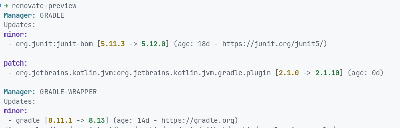

# Renovate for Nix Devshells

Run and configure [Renovate](https://github.com/renovatebot/renovate) via devshell.
The idea is to run Renovate as an on-demand or scheduled CI job - without the need for a continuously running server.

If you have a NixOS installation, the [NixOS Renovate module](https://github.com/NixOS/nixpkgs/blob/nixos-24.11/nixos/modules/services/misc/renovate.nix) might be a better fit.
Unlike the NixOS module, which runs Renovate as a continuously running systemd service, this approach allows you to execute Renovate only when needed, either in CI or manually.

This project also includes `renovate-preview`, a wrapper around Renovate that prints pending updates in a human-readable format.

## Installation

Add this repository as a flake input:

```nix
inputs.renovate.url = "github:raphiz/renovate-devshell";
```

## Usage

Simply import the module into your [devenv.sh](https://devenv.sh/) or [devshell.nix](https://github.com/numtide/devshell) module system:

```nix
imports = [
  inputs.renovate.modules.default
];

renovate.enable = true;
renovate.settings = {
  # Your Renovate config here, for example:
  # platform = "gitea";
  # endpoint = "https://git.example.com";
};
```

This will add the `renovate` and `renovate-preview` CLIs to your `$PATH`.
It also sets the `RENOVATE_CONFIG_FILE` environment variable with the configured settings.

> [!NOTE]
> I recommend using a dedicated shell for Renovate to reduce the closure size for both the CI job and local development.

Before you get started, make sure your project is onboarded (it must include a [renovate.json](https://docs.renovatebot.com/getting-started/installing-onboarding/#configuration-location) file).

You can get a preview of pending updates with the `renovate-preview` command (see below).

To run this as part of your CI job, [configure the settings](https://docs.renovatebot.com/examples/self-hosting/) according to your needs (at least the [platform](https://docs.renovatebot.com/modules/platform/) related properties).
For secrets (such as `RENOVATE_GITHUB_COM_TOKEN`, `RENOVATE_PASSWORD`, `RENOVATE_TOKEN`, etc.), use environment variables and the secrets mechanism of your CI platform.

### Running just the preview script

If you only want to use the preview script, run the following command:

```nix
nix run github:raphiz/renovate-devshell#renovate-preview -- --no-validate
```

### Supported CI Systems

This setup works with various CI systems, including GitHub Actions, GitLab CI/CD, and Jenkins.

## `renovate-preview`

The `renovate-preview` CLI is a wrapper around Renovate.
For basic usage, call it without any additional parameters, and you will receive output as follows:



For more details, run `renovate-preview --help`.

## Examples

### GitHub Action

...to be done...

## FAQ

## Contributing

Contributions are welcome!
Feel free to open an issue or PR.
